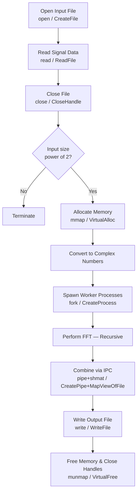

# Linux & Windows Parallel FFT Engine with System Call Analysis

A cross-platform systems programming project implementing and benchmarking **15 OS system calls** across Linux (Ubuntu 24) and Windows 11, integrated into a **parallel Fast Fourier Transform (FFT)** computation engine. Both versions read integers from `input.txt`, run a basic FFT, and write results to `output.txt` while timing key steps.

> **Course:** CT-353 Operating Systems | **Type:** Complex Computing Problem (CCP)


---

## Project Structure

```
OS CPP/
├── linux_syscalls_demo/
│   ├── input.txt
│   └── main.cpp
├── windows_syscalls_demo/
│   ├── input.txt
│   ├── main.cpp
│   └── output.txt
└── README.md
```

---

## FFT Pipeline Flow



---

## System Call Mapping

| Category    | Linux                             | Windows                                              |
|-------------|-----------------------------------|------------------------------------------------------|
| File I/O    | `open`, `read`, `write`, `close`  | `CreateFile`, `ReadFile`, `WriteFile`, `CloseHandle` |
| Process     | `fork`, `exec`, `wait`            | `CreateProcess`, `WaitForSingleObject`               |
| Memory      | `mmap`, `munmap`                  | `VirtualAlloc`, `VirtualFree`                        |
| IPC         | `pipe`, `shmget`, `shmat`         | `CreatePipe`, `CreateFileMapping`, `MapViewOfFile`   |
| Permissions | `chmod`, `chown`, `umask`         | `SetFileSecurity` (simulated)                        |

---

## Performance Results

### Execution Time

| Metric                | Linux (Ubuntu) | Windows 11 |
|-----------------------|---------------|------------|
| File Read Time (sec)  | 0.004666      | 0.003902   |
| FFT Time (sec)        | 0.000029      | 0.000909   |
| Total Execution (sec) | 0.011270      | 0.016180   |
| CPU Time (sec)        | 0.003687      | 0.046875   |

### Memory Usage

| Metric                       | Linux (Ubuntu) | Windows 11 |
|------------------------------|---------------|------------|
| Memory Usage (KB)            | 4236 KB       | 5484 KB    |
| Memory Allocation Time (sec) | 0.000212      | 0.000828   |

### System-Level

| Metric              | Linux (Ubuntu) | Windows 11 |
|---------------------|---------------|------------|
| File I/O Time (sec) | 0.001787      | 0.008071   |
| IPC Time (sec)      | 0.004323      | 0.000920   |
| Process Creation    | ~0.000000     | ~0.000000  |

> **Key Findings:** Linux outperforms Windows in FFT computation, memory efficiency, and file I/O. Windows shows advantages in file read speed and IPC timing. Windows carries ~12.7× more CPU overhead.

---

## Requirements

### Linux
- GCC / G++
- POSIX libraries

### Windows
- MinGW or MSVC

---

## Build & Run

### Linux

```bash
cd linux_syscalls_demo
g++ main.cpp -o os_project
./os_project
```

### Windows (MinGW)

```bash
cd windows_syscalls_demo
g++ main.cpp -o main.exe
./main.exe
```

---

## Input / Output Format

**Input** (`input.txt`): one integer per line. Lines starting with `#` are ignored.

```
1
2
3
4
```

**Output** (`output.txt`): FFT results written as index, real, imaginary columns.

```
Index    Real       Imag
0        10.000     0.000
1        -2.000     2.000
```

> Input size **must be a power of 2** (e.g., 4, 8, 16, 64, 1024).

---

## Key Observations

- **Linux system calls** are lighter and closer to the kernel → faster FFT and lower overhead
- **Windows APIs** introduce abstraction layers → higher CPU time (~12.7×) and memory consumption
- **Windows IPC** (named pipes + shared memory) is faster than Linux's `shmget`-based approach
- **Memory management** is more efficient on Linux — lower usage and faster allocation
- Linux tested inside VirtualBox — bare-metal results would be even better

---

## Limitations

- Small dataset size makes performance differences harder to generalize
- Process-based parallelism used instead of threads (no `pthreads` / Win32 threads)
- Linux run inside VirtualBox adds measurement overhead
- Profiling tools (`perf`, `strace`, Windows Performance Analyzer) were not used

---

## References

1. Silberschatz, Galvin & Gagne — *Operating System Concepts*
2. Tanenbaum, A. S. — *Modern Operating Systems*
3. Linux Manual Pages — https://man7.org/linux/man-pages/
4. Microsoft Docs — https://learn.microsoft.com/
5. FFTW Documentation — http://www.fftw.org/

---

## Group Members

| Name            | Roll No  |
|-----------------|----------|
| Muhammad Anas   | DT-23301 |
| Muhammad Arish  | DT-23042 |
| Syed Razi Uddin | DT-23043 |

**Instructor:** Dua Agha | **Course:** CT-353 Operating Systems

---

## License

This project is licensed under the MIT License — see the [LICENSE](LICENSE) file for details.
